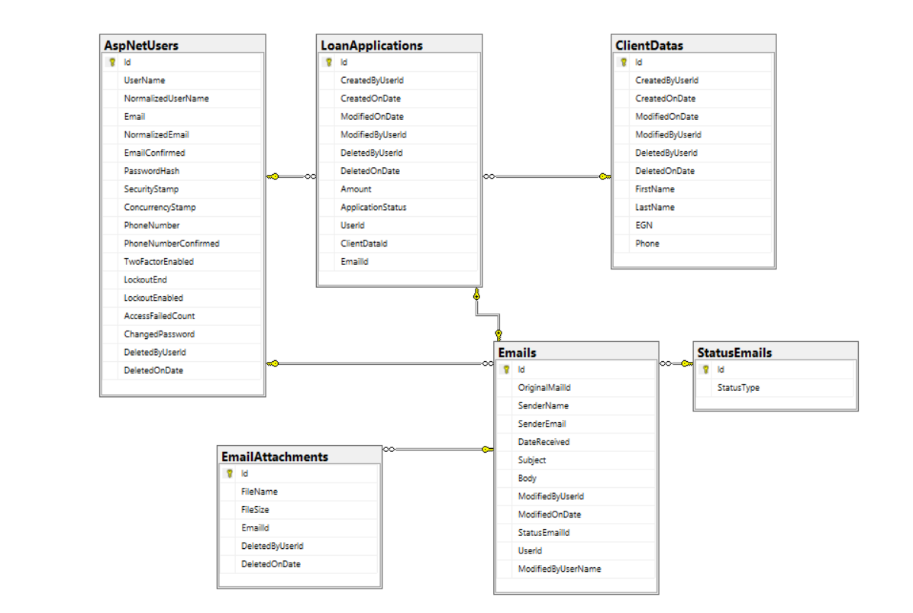

## TBIEmailManager

Team project for the end of Telerik Academy .NET Alpha 2019.

#### Made by: Ivan Madin and Kristina Asenova

### Project Purpose

The main aim is to deliver a system, capable to facilitate tracking, monitoring and processing customer loan applications coming to the bank via e-mail.

#### Technologies used: 
   - .NET Core 2.2
   - Entity Framework Core 2.2.6
   - SQL Server 
   - Visual Studio 2019 Community
   - HTML/CSS 
   - Razor engine
   - Bootstrap
   - Serilog
   - JavaScript / jQuery 

#### Features

 The application is private and visible with authentication.
 Two areas are available: 
 
 1. Manager Part
 It supports the following functionalities:
 
 - create operator account
 - change all statuses
 - see which operator has changed status or made the change
 - reject or accept application
 
 2. Operator part
 It supports the following functionalities:
 
 - changes statuses, but with a few restrictions
 - reject or accept application
 - fill the client's data
 
#### Architecture

##### 1. Data layer:

*   Holds the models, entities and configurations for the database.

Database: dataTable.png 

##### 2. Service layer:

*   Holds business logic, DTOs represent data layer and Mappers.

##### 3. ASP layer:

*   Holds the UI, Mappers, ViewModels - uses MVC

#### Credentials:

Username: krisi/madinftw
Password: krisi123/madin123
